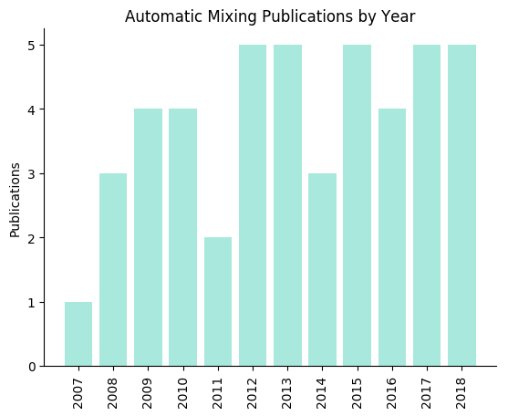
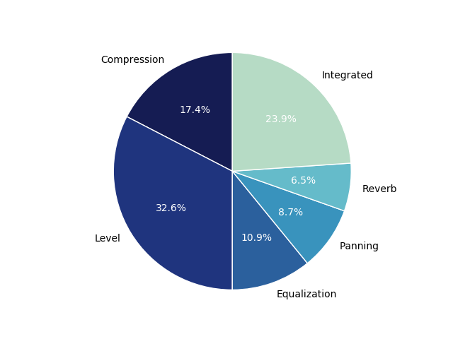
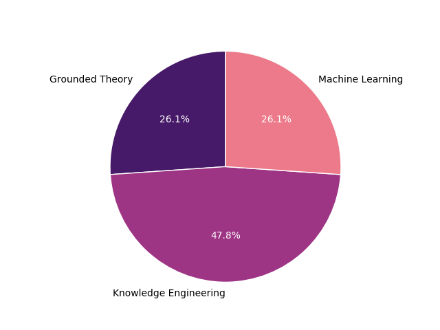

# Automatic Mixing Research
This list serves to track and archive scientific work in the area of automatic multitrack audio mixing.

## Overview
Mixing is a complex process carried out by audio engineers during the music production process. It involves a number of different steps each of which oftentimes have many substeps dependent on the source material and the desired result. In order to better categorize the work in this area the following mix processes are identified.

* `Level`
* `Panning`
* `Equalization`
* `Compresssion`
* `Reverb`

Systems that incorporate more than one procees are categorized as `integrated`.
## Level
|Year|Title|Authors|Approach|Resources|
|---|---|---|---|---|
## Panning
|Year|Title|Authors|Approach|Resources|
|---|---|---|---|---|
## Equalization
|Year|Title|Authors|Approach|Resources|
|---|---|---|---|---|
## Compression
|Year|Title|Authors|Approach|Resources|
|---|---|---|---|---|
|2012|[An autonomous method for multi-track dynamic range compression](https://www.dafx12.york.ac.uk/papers/dafx12_submission_6.pdf)|J. A. Maddams, S. Finn, and J. D. Reiss|GT|No|
## Reverb
|Year|Title|Authors|Approach|Resources|
|---|---|---|---|---|
|2017|[Intelligent multitrack reverberation based on hinge-loss markov random field](http://www.aes.org/e-lib/browse.cfm?elib=18766)|A. L. Benito and J. D. Reiss|ML|[Yes](https://code.soundsoftware.ac.uk/projects/multitrackreverb)|
## Integrated
|Year|Title|Authors|Approach|Resources|
|---|---|---|---|---|
|2017|[Towards an automated multitrack mixing tool using answer set programming](http://smc2017.aalto.fi/media/materials/proceedings/SMC17_p422.pdf)|F. Everardo|KE|No|
|2017|[Analysis and prediction of the audio feature space when mixing raw recordings into individual stems](http://www.aes.org/e-lib/browse.cfm?elib=19245)|M. A. Martínez Ramírez and J. D. Reiss|ML|[Yes](https://github.com/mchijmma/audioFeatures-stemMixing)|
|2010|[Advanced automatic mixing tools for music](https://qmro.qmul.ac.uk/jspui/handle/123456789/614)|E. Perez Gonzalez|GT|No|
|2008|[Improved control for selective minimization of masking using interchannel dependancy effects](http://legacy.spa.aalto.fi/dafx08/papers/dafx08_15.pdf)|E. Perez Gonzalez and J. D. Reiss|GT|No|
# Statistics

